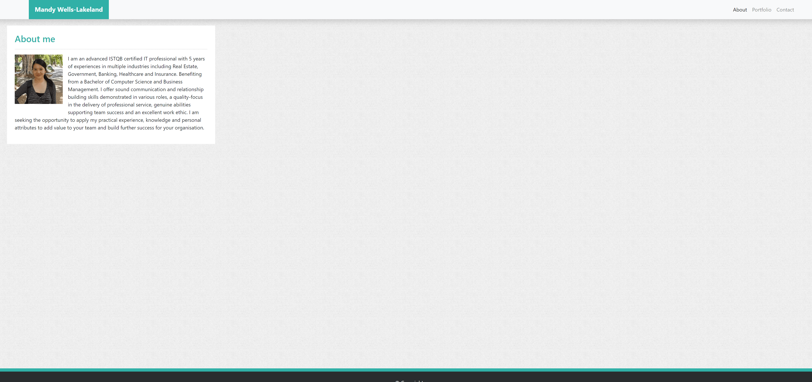

# 02-Responsive-Portfolio

## Overview
* Created the following pages: `index.html`, `portfolio.html` and `contact.html` using Bootstrap's grid system (containers, rows, and columns)

* On an `xs` screen, content takes up the entire screen.

* Portfolio contains name, email and phone number

* Portfolio contains links to GitHub profile, LinkedIn Profile, and Resume PDF

* Each project is listed with title, deployment URL, GitHub URL, and a screenshot

* Portfolio has a polished mobile responsive user interface

## App Screenshot

## App url
- https://github.com/mandywl/02-Responsive-Portfolio-Mandy
- https://mandywl.github.io/02-Responsive-Portfolio-Mandy/
